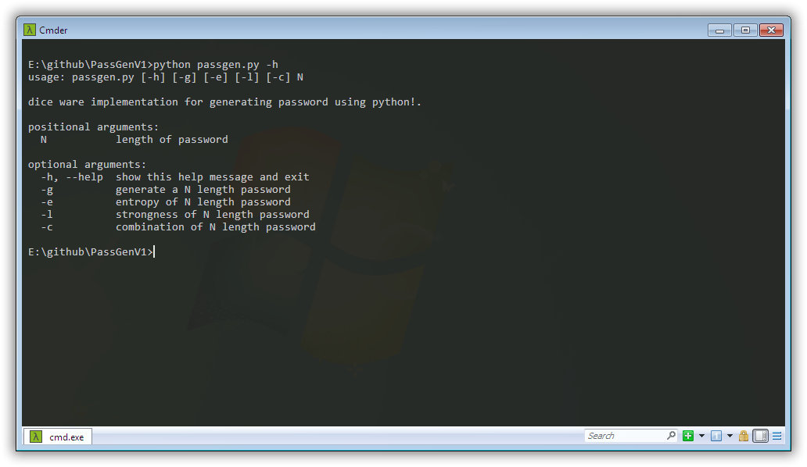
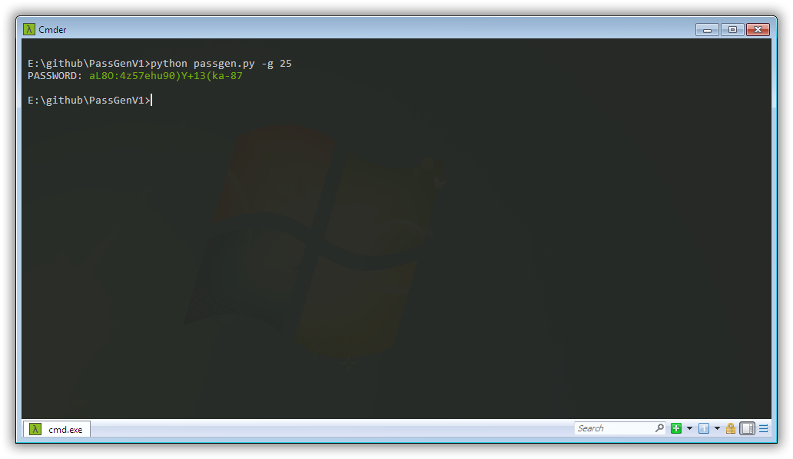
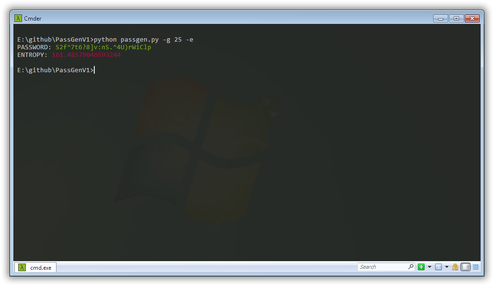
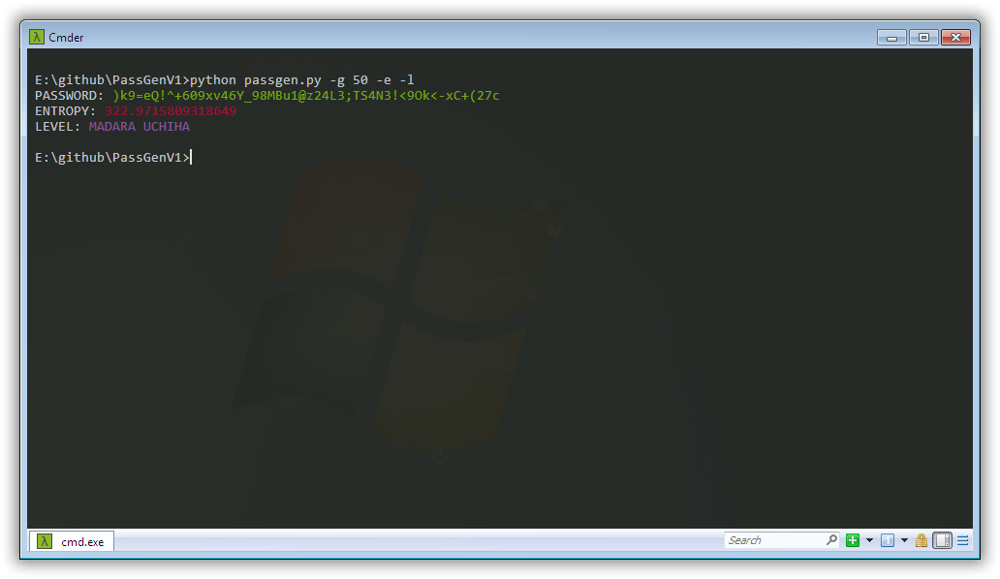
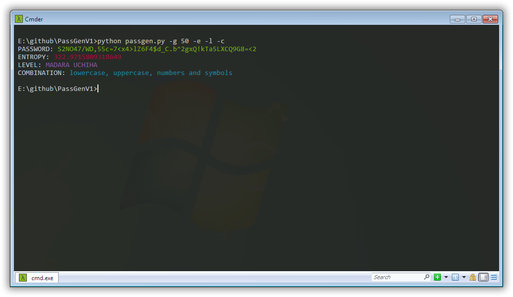

<p align="center"><a href="data/passgen.png"></a></p>
<h1 align="center">PassGen</h1>
<p align="center">dice ware implementation for generating password using python!.</p>
<p align="center">
	
	<a href="https://github.com/mandarnaik016/PassGen/blob/master/passgen.py">
		
	</a>
  <a href="https://github.com/mandarnaik016/PassGen/blob/main/LICENSE" target="_blank">
    
  </a>
  <a href="https://twitter.com/_md_naik" target="_blank">
    
  </a>
</p>

## :hear_no_evil: What's PassGen?
**PassGen** is yet another password generator that generates a random password with more randomness!. Oridinary password generator uses predefined strings and chooses random characters to produce a password. PassGen is a mimic of the dice ware method (matrix method) for generating passwords.

## Install

```sh
git clone git@github.com:mandarnaik016/PassGen.git
```

## Usage

Please see `passgen.py -h` for a list of available options.



To generate a password use `passgen.py -g 25` where `25` is the length of password.



To generate a password along with entropy use `passgen.py -g 25 -e` where `25` is the length of password and `-e` to show entropy.



To generate a password along with entropy and level use `passgen.py -g 50 -e -l` where `50` is the length of password, `-e` to show entropy and `-l` to show level.



To generate a password along with entropy, level and combination use `passgen.py -g 50 -e -l -c` where `50` is the length of password, `-e` to show entropy, `-l` to show level and `-c` to show password combination.



## Author

👤 **Mandar Naik**

- Website: https://mandarnaik016.github.io/
- Twitter: [@_md_naik](https://twitter.com/_md_naik)
- Github: [mandarnaik016](https://github.com/mandarnaik016)
- LinkedIn: [mandar-naik-65354a186](https://linkedin.com/in/mandar-naik-65354a186)

## :open_hands: Contributing

Contributions, issues and feature requests are welcome!<br />Feel free to check [issues page](https://github.com/mandarnaik016/PassGen/issues).

## :heart: Show your support

Give a ⭐️ if this project helped you!

## 📝 License

Copyright © 2022 [Mandar Naik](https://github.com/mandarnaik016).<br />
This project is [GPL v3](https://github.com/mandarnaik016/PassGen/blob/main/LICENSE) licensed.
